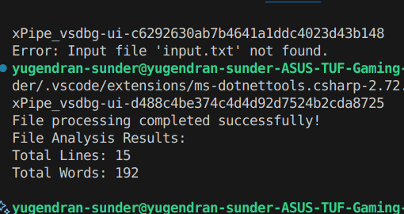

# C# & .net

# File I/O and Exception Handling

- An application that reads from and writes to files.
- Read text from a file (e.g., a log file or a simple CSV).
- Process the data (for example, count words or lines).
- Write the result to a new file.
- Implement exception handling to manage file-related errors (such as FileNotFoundException or IOException).

